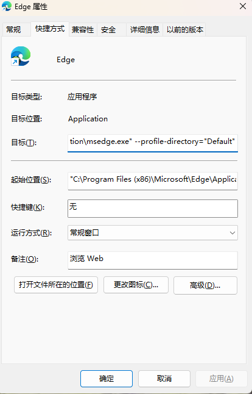

## 获取用户profile名称
右键Edge快捷方式，选择属性  
  
在目标中有--profile-directory=xxx
默认为Default，或Profile 1  
profile-dir可能的值在"C:\Users\USERNAME\AppData\Local\Microsoft\Edge\User Data"  
在该路径下可以找到Default以及零个或多个Profile #文件夹，
其中#为数字，如Profile 1、Profile 2等等。
## 安装
任何支持DrissionPage的python版本与最新的DrissionPage模块即可。
```shell
pip install DrissionPage
```
## 使用
在main.py中把Edge浏览器用户profile名称如下形式添加到user_list中，然后运行main.py即可。
```python
user_list = ['Profile 1', 'Default', 'Profile 2', 'Profile 3']
```
**注意**，要先登录！  

## 未来
目前本人还未了解DrissionPage模块的打包方法，
所以暂时只能在本地运行，
未来（有人催的话）会尝试打包成可执行文件。
